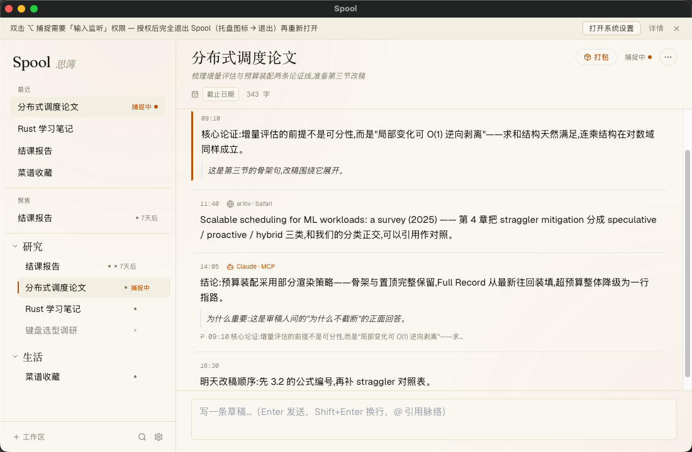
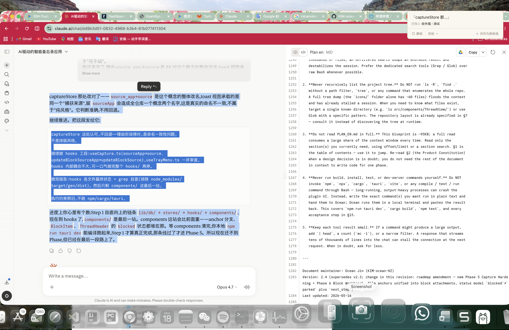
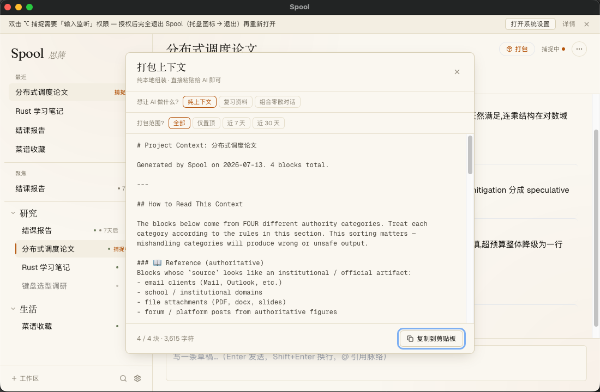
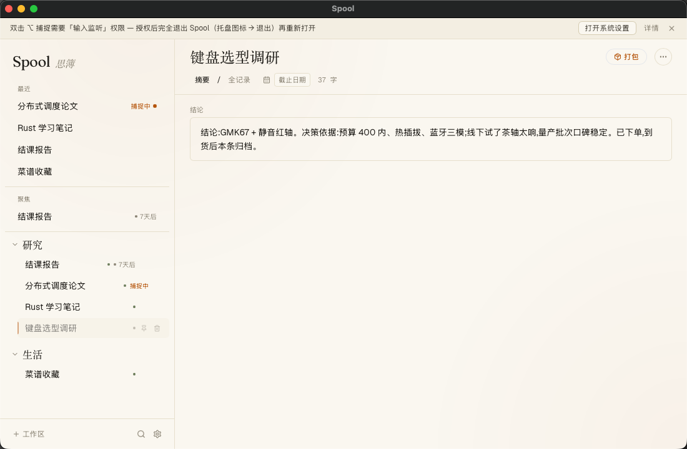

# Spool

> 思簿 — a context hub for long-running projects.

At the moment you naturally produce a fragment of information — a good answer from an AI, a decision buried in an email, a link to a document, a half-formed thought — Spool lets you capture that fragment effortlessly, threads fragments together under a two-tier **Workspace → Thread** structure, and packs any thread into a paste-ready briefing on demand — so you can re-enter a project, or re-brief an AI, instantly.

## Why it exists

LLMs do not remember your project. Every new conversation, you re-explain the context. Across multiple AIs, multiple tabs, multiple emails, spanning many days, a project's context gets shredded — and reassembling it falls on your memory.

Spool compresses "re-explaining" into "a single paste."

## The core loop

```
   Capture  ──▶  Thread  ──▶  Pack  ──▶  (paste, re-enter)
      ▲                                       │
      └───────────── days later ──────────────┘
```

- **Capture** — a global shortcut grabs whatever is on your clipboard and writes it into the current thread. Rides existing Cmd+C muscle memory. No decisions at capture time. A non-activating overlay confirms the save on whatever screen you're on, so the main window never has to come forward.
- **Thread** — an append-only timeline of fragments under one project. Two tiers only: Workspace (big topic) → Thread (small project). No infinite nesting. On open the feed lands at the newest blocks — they ARE "where you left off," no manual status note to maintain.
- **Pack** — one click assembles a paste-ready Markdown briefing of the thread. Pure string assembly, no AI in the hot path, fully deterministic.

## Status

v1 feature-complete and packaged. macOS primary; Windows/Linux feasible via Tauri (capture-trigger details differ).

All twelve phases of the implementation roadmap are landed:

| Phase | Surface |
|---|---|
| 1 | Data layer (SQLite + workspaces / threads / blocks / attachments + FTS5) |
| 2 | UI skeleton + thread view |
| 3 | Global shortcut capture |
| 4 | Context packer (the crown feature) — pure function, paste-ready Markdown |
| 5 | Capture hardening: always-on-top overlay window, double-tap ⌥ trigger, editable source badge, browser tab-title auto-detection |
| 6 | Block workbench: file / folder / URL attachments, inline edit, annotations, smart truncation, drag-to-attach |
| 7 | Full-text search: FTS5 trigram tokenizer (Chinese-correct) + short-query LIKE fallback, contextual three-line snippets |
| 8 | Deadlines, active / parked / done status, three-section sidebar (summary + cross-workspace focus + workspace tree), drag-between-workspaces, shortcut configuration UI |
| 9 | Thread completion + digest view (conclusion · pinned blocks · files & links) |
| 10 | @-mention references between threads in the same workspace |
| 11 | ~~Optional AI layer~~ — removed 2026-07-09: Spool itself ships zero AI; cowork happens through the MCP server (below) |
| 12 | Settings panel (shortcuts, language, MCP hookup, autostart, clear data), unified toast surface, tail-window for long threads, packaging |

## Design principles (non-negotiable)

1. Capture must be zero-friction — one keypress, no decisions.
2. Local-first, private by default — Spool makes no network requests at all; the only way data leaves is your own MCP client reading it, behind two opt-in switches.
3. A thread is a log, not a chat — append-only, time-ordered, quiet.
4. Retrieval is deterministic — pack and search never call AI or the network.
5. AI is a librarian, not an author — anything an AI files through MCP is attributed, append-only, and can never overwrite what you wrote by hand.
6. Exactly two tiers of structure — no infinite nesting.

The full product constitution, rejected ideas, and the feature filter are in `PLAN_EN.md` §2.

## Stack

- **Tauri 2** desktop shell, with a second non-activating overlay window for capture confirmations
- **React 18 + TypeScript** (strict mode) on **Vite** (multi-page build)
- **Tailwind CSS** for layout; design tokens in CSS variables
- **Zustand** for state
- **SQLite** via `tauri-plugin-sql`, FTS5 with the trigram tokenizer
- **MCP server** (`spool --mcp`, stdio, default OFF): the AI surface — read tools (list/search/dedup/pack) plus consented, attributed write tools

## Building from source

Requirements: Node 20+, Rust toolchain (stable), Tauri 2 system dependencies (see the Tauri docs for your OS).

```bash
npm install
npm run tauri dev     # dev with HMR
npm run tauri build   # production .dmg / installer
npm test              # vitest
```

The macOS double-tap-⌥ capture trigger requires **Input Monitoring** AND **Accessibility** permission (System Settings → Privacy & Security). Spool prompts for Input Monitoring on first launch and shows a banner until it is granted; the grant takes effect after restarting Spool. A user-bound capture shortcut (Settings → 全局快捷键) works without either permission. On first capture from a browser, macOS will prompt once for **Automation** permission against that browser — granting it lets Spool tag captures with the active tab title instead of just the app name.

## AI via MCP (optional, no keys, no accounts)

Spool ships **zero built-in AI** — no API keys, no local models, nothing to configure, and the app's CSP structurally forbids any external network request. Instead, Spool speaks the [Model Context Protocol](https://modelcontextprotocol.io): your own AI client (Claude Desktop, Cursor, or any MCP-capable tool) connects to `spool --mcp` over stdio and works with your threads directly.

- **One-click hookup**: Settings → 通用 → MCP 服务 → 一键接入 writes the client's config for you (with a backup). A 「复制使用提示」 button gives you a paste-ready briefing that teaches the AI how to use Spool well.
- **Read tools**: list threads (with one-line summaries and read-budget hints), full-text search, near-duplicate detection, block paging, and the same deterministic pack the GUI produces.
- **Write tools** (a second, separate consent): create a thread, append a block, refresh a thread's one-line summary. Every AI write carries an enforced source label (e.g. `Claude · MCP`) and shows a distinct badge in the GUI; an AI can never overwrite a summary you wrote by hand.

## Keyboard shortcuts

| Key | Action |
|---|---|
| Double-tap ⌥ | Capture clipboard (macOS only, system-global) |
| ⌘⇧F | Global search |
| ⌘⇧P | Pack the active thread |
| ⌘N | New thread in the current workspace |
| ⌘, | Settings |
| @ | Mention another thread inside the composer |
| Enter / Shift+Enter | Send / newline in the composer |
| Esc | Dismiss any overlay, modal, or inline edit |

The global search shortcut is user-rebindable under **Settings → 全局快捷键**; an optional capture shortcut (unbound by default) can be recorded there too.

## Project structure

```
src-tauri/            # Tauri / Rust: capture, overlay window, system integration
src/
  overlay/            # the capture overlay window (separate Vite entry)
  components/         # Sidebar, ThreadView, Capture, Pack, Search, Settings, ui
  lib/                # core logic (capture, pack, search, db, i18n)
  hooks/              # React hooks
  stores/             # Zustand stores
  styles/             # design tokens + global styles
scripts/              # one-off generators (e.g. the amber-S app icon)
PLAN_EN.md            # the project blueprint and source of truth
```

`PLAN_EN.md` defines what Spool is, what it isn't, the phase-by-phase roadmap, and the explicit non-goals. Read §2 (Product Constitution) before opening a PR or proposing a feature.

## Screenshots


- Main window: sidebar + active thread

- The corner overlay confirming a capture

- The pack dialog with assembled briefing

- A completed thread's digest view


## License

Not licensed yet — all rights reserved until a license is chosen.

## Author

Ocean Jin · [@KIM-ocean-HZ](https://github.com/KIM-ocean-HZ)