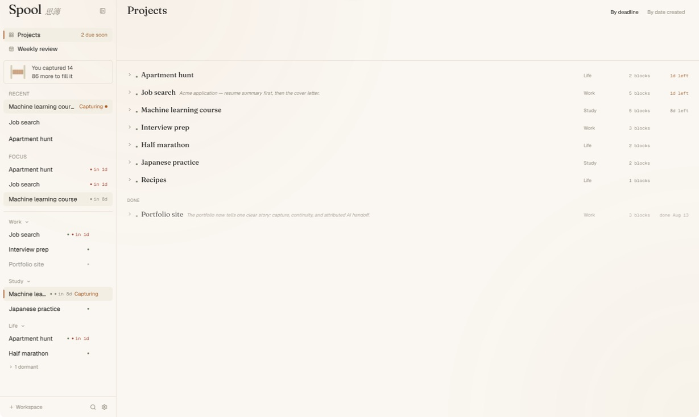

<p align="center">
  
</p>

# Spool

> 思簿 — a context hub for long-running projects.
> Logo: a spool viewed from above, its thread pulling free — [watch it assemble](docs/logo/spool-logo-assembly.mp4).

<p align="center">
  <b><a href="https://spoolapp.org">spoolapp.org</a></b> ·
  <b><a href="https://github.com/KIM-ocean-HZ/spool/releases/latest/download/Spool-macOS-arm64.dmg">Download for macOS</a></b>
  <br>
  <sub>The site walks the whole loop in an interactive demo (English / 中文) — no install needed.<br>
  The download is a signed, notarized <code>.dmg</code>. Free, offline, no account.</sub>
</p>

At the moment you naturally produce a fragment of information — a good answer from an AI, a decision buried in an email, a link to a document, a half-formed thought — Spool lets you capture that fragment effortlessly, files fragments under a two-tier **Workspace → Project** structure, and packs any project into a paste-ready briefing on demand — so you can re-enter a project, or re-brief an AI, instantly.

## Why it exists

LLMs do not remember your project. Every new conversation, you re-explain the context. Across multiple AIs, multiple tabs, multiple emails, spanning many days, a project's context gets shredded — and reassembling it falls on your memory.

Spool compresses "re-explaining" into "a single paste."

## The core loop

```
   Capture  ──▶  Project ──▶  Pack  ──▶  (paste, re-enter)
      ▲                                       │
      └───────────── days later ──────────────┘
```

- **Capture** — a global shortcut grabs whatever is on your clipboard and writes it into the current project. Rides existing Cmd+C muscle memory. No decisions at capture time. The confirmation overlay opens with the cursor already in a note box — type the thought that made you save this and press Enter, or click anywhere to skip. Your own note outlives the excerpt, and connected AIs treat it as the highest-signal line. The main window never has to come forward.
- **Project** — an append-only timeline of fragments. Two tiers only: Workspace (big topic) → Project (one piece of work). No infinite nesting. On open the feed lands at the newest blocks — they ARE "where you left off," no manual status note to maintain.
- **Pack** — one click assembles a paste-ready Markdown briefing of the project. Pure string assembly, no AI in the hot path, fully deterministic.

## Status

**v0.4.0** — feature-complete and shipping on macOS. Windows and Linux builds are not implemented;
capture, focus, cancellation, paths, and distribution require platform-specific work.

- **Distribution**: Developer ID–signed, Apple-notarized `.dmg`, straight from [Releases](https://github.com/KIM-ocean-HZ/spool/releases/latest). Not on the Mac App Store — sandboxing conflicts structurally with the global capture trigger.
- **Website**: [spoolapp.org](https://spoolapp.org), with an interactive walkthrough of capture → pack → re-brief → MCP in English and Chinese.
- **No auto-update channel** yet: direct distribution means new versions are a manual download.

### New in v0.4.0

The optional external-AI routes below add no keys or accounts to Spool and no network egress from Spool itself.

- **A CLI engine slot.** If you already have Claude Code, the Codex CLI, or the Gemini CLI installed and logged in, Spool can run it as a local subprocess to **follow up** on things you asked it to watch, write a cross-project **weekly review**, or help draft the lines worth following. The network request happens inside that CLI, on your own account's quota — Spool stores no API key and makes no HTTP request of its own. Gemini does not run Follow Up.
- **Visible runs and honest records.** Follow Up runs in the right-hand rail; Weekly Review has its own screen, and completed runs for those two actions leave a record. A follow-up-goal draft stays only in its editor until you save or discard it. Intermediate progress appears when the CLI exposes it, and nothing that would change your existing notes is applied silently.
- **Follow up.** You write a few plain lines describing what to watch for; the engine searches the web against exactly those lines and files what it finds for your review. It stays quiet when there is no news — the one action that deliberately reaches the open web, and the only one whose web tools are switched on.
- **Retirement and correction, instead of overwriting.** You can mark a block as no longer valid, or point at the one sentence in an older block that a newer one corrects. Retired blocks leave the pack but stay in the library and stay searchable, and the pack says out loud that they were left out. An append-only log must never silently overwrite a fact.
- **Annotations say who wrote them.** A note an AI wrote through MCP renders as `ai note:` in a pack and can never be read as your own judgement — that distinction is the whole point of the authority header.
- **A review queue for AI writes.** An AI splitting one passage across several projects, or proposing a correction, lands in a queue you approve; it does not land in your timeline.
- **Packs are context, full stop.** The three "what should the AI do" task types are gone — a pack now carries your context and the reading instructions, and you state the task yourself in whatever chat you paste it into.

All twelve phases of the original implementation roadmap were landed in v0.3.0:

| Phase | Surface |
|---|---|
| 1 | Data layer (SQLite + workspaces / projects / blocks / attachments + FTS5) |
| 2 | UI skeleton + project view |
| 3 | Global shortcut capture |
| 4 | Context packer (the crown feature) — pure function, paste-ready Markdown |
| 5 | Capture hardening: always-on-top overlay window, double-tap ⌥ trigger, editable source badge, browser tab-title auto-detection |
| 6 | Block workbench: file / folder / URL attachments, inline edit, annotations, smart truncation, drag-to-attach |
| 7 | Full-text search: FTS5 trigram tokenizer (Chinese-correct) + short-query LIKE fallback, contextual three-line snippets |
| 8 | Deadlines, active / parked / done status, three-section sidebar (summary + cross-workspace focus + workspace tree), drag-between-workspaces, shortcut configuration UI |
| 9 | Project completion + digest view (conclusion · pinned blocks · files & links) |
| 10 | @-mention references between projects in the same workspace |
| 11 | ~~Optional AI layer~~ — removed 2026-07-09: Spool itself ships zero AI; cowork happens through the MCP server (below) |
| 12 | Settings panel (shortcuts, language, MCP hookup, autostart, clear data), unified toast surface, tail-window for long projects, packaging |

## Design principles (non-negotiable)

1. Capture must be zero-friction — one keypress, no decisions.
2. Local-first, private by default — Spool itself makes no network request, ever, and its CSP forbids one structurally. Content reaches another program only through a hand-off you choose: paste a Pack, enable an MCP client, or run a CLI action. MCP is opt-in, and its write side is a separate switch.
3. A project is a log, not a chat — append-only, time-ordered, quiet.
4. Retrieval is deterministic — pack and search never call AI or the network.
5. AI is a librarian, not an author — anything an AI files through MCP is attributed, append-only, and can never overwrite what you wrote by hand.
6. Exactly two tiers of structure — no infinite nesting.

The full product constitution, rejected ideas, and the feature filter are in `PLAN_EN.md` §2.

## Stack

- **Tauri 2** desktop shell, with a second non-activating overlay window for capture confirmations
- **React 18 + TypeScript** (strict mode) on **Vite** (multi-page build)
- **Tailwind CSS** for layout; design tokens in CSS variables
- **Zustand** for state
- **SQLite** via `tauri-plugin-sql`, FTS5 with the trigram tokenizer
- **MCP server** (`spool --mcp`, stdio, default OFF): the AI surface — 18 tools, read tools (list/search/dedup/pack) plus consented, attributed write tools
- **CLI engine slot**: `claude`, `codex`, or `gemini` runs as a local subprocess for Follow Up, Weekly Review, and follow-up-goal drafting — detected on disk, never bundled, never given a key

## Building from source

Requirements: Node 20+, Rust toolchain (stable), Tauri 2 system dependencies (see the Tauri docs for your OS).

```bash
npm install
npm run tauri dev     # dev with HMR
npm run tauri build   # production .dmg / installer
npm test              # vitest
```

The macOS double-tap-⌥ capture trigger requires **Input Monitoring** permission (System Settings → Privacy & Security). Spool checks its status at launch and shows a setup banner while it is missing; using that banner's capture setup action triggers the macOS request, and the grant takes effect after restarting Spool. **Accessibility is optional** and does two things. First, it makes a *consumed* double-tap exclusive: when Spool captures, it deletes the second ⌥ press from the event stream, so other apps bound to the same gesture (Claude Desktop's quick entry, for one) do not also fire. Second, it is what hands the capture toast the keyboard, so the note box can be typed into straight away — macOS delivers keystrokes only to the active app, and `AXFrontmost` is the one route to activation that is honoured immediately rather than deferred. Without Accessibility, capture still works, but those apps may fire alongside it and the note box has to be clicked before it will take typing. A bare double-tap with nothing freshly copied is still passed through to them untouched. A user-bound capture shortcut (Settings → 全局快捷键) works without either permission. On first capture from a browser, macOS will prompt once for **Automation** permission against that browser — granting it lets Spool tag captures with the active tab title instead of just the app name.

## AI via MCP (optional, no keys, no accounts)

Spool ships **zero built-in AI** — no API keys, no local models, nothing to configure, and the app's CSP structurally forbids any external network request. Instead, Spool speaks the [Model Context Protocol](https://modelcontextprotocol.io): your own AI client (Claude Desktop, Codex — including a Codex conversation inside the ChatGPT desktop app — Cursor, or another MCP-capable tool) connects to `spool --mcp` over stdio and works with your projects directly. An ordinary ChatGPT conversation runs remotely and cannot reach a local stdio server.

**You do not need any of this to use Spool with an AI.** ⌘⇧P packs a project into Markdown you paste into a browser tab — nothing to install, nothing to connect, and no feature is withheld from you for skipping it. MCP buys exactly one thing: your AI fetches the context itself instead of waiting for you to paste it, and can file conclusions back with its name on them.

- **One-click hookup**: Settings → MCP → 一键接入 writes the client's config for you (with a backup). Restart the client so it can load the setting; Spool separately shows whether that client has actually connected. Next to it, 「复制使用提示」 is the single place the how-to lives — one short paragraph, readable by you and paste-ready for the AI.
- **Read tools** (12): list projects (with one-line summaries and read-budget hints), a cross-project digest of recent activity, full-text search, near-duplicate detection, block paging (including blocks you have retired), the same deterministic pack the GUI produces, a read-only library hygiene checkup, one call that answers "how is this project doing" in a single round-trip, a read of what a project is currently watching for, plus three that hand back a briefing and the job to do with it — distill one project, report one project's health, review the week across all of them.
- **Write tools** (6, behind a second and separate consent): create a project, append a block (optionally citing the block it builds on, or proposing that one point in it was corrected), refresh a project's one-line summary, and queue a batch of blocks for your review. Two of the six store nothing at all — they put a request in front of you and wait: *ask to read a file already in a project*, and *suggest a change to what a project watches*. Every AI write carries an enforced source label (e.g. `Claude · MCP`) and shows a distinct badge in the GUI; an AI can never overwrite a summary you wrote by hand, never retire one of your blocks, and never write a note that reads as if you wrote it.
- **What an AI can and cannot do to history**: it may append, and it may *propose* that one point in an older block was corrected — which you approve or discard. Marking a block as no longer valid stays yours alone.

### What to say once connected

You talk to your AI in plain language — no tool names, no menus. The how-to is kept in exactly
one place rather than repeated here: **Settings → MCP → 「复制使用提示」**, a short paragraph you
can paste to your AI or simply read yourself. The server also tells every client how you are
likely to phrase things, so a freshly connected AI opens by naming what it can do with your
actual projects.

## Maintenance by your own CLI (v0.4.0, optional, still no keys)

Reading through a chat client is one half. The other half is checking what changed while you were
away — and for that Spool can drive a coding CLI you already own. If `claude` (Claude Code),
`codex` (Codex CLI), or `gemini` (Gemini CLI) is on your machine and logged in, Spool detects it
and offers these actions:

| Action | What it does | Reaches the web |
|---|---|---|
| **Follow up** | Search for news against lines *you* wrote describing what to watch; findings queue for your review | **yes** |
| **Weekly review** | One review across every project, kept in the dedicated Weekly Review screen | no |
| **Draft follow-up goals** | Suggest the lines worth watching for one project; you decide what to keep | no |

Three things make this safe to leave switched on, and all three are deliberate:

- **Spool never becomes a network client.** It spawns the CLI as a local subprocess; the request
  leaves from there, under your own login and quota. No API key is stored, entered, or needed.
- **You can see where it ran.** Follow Up lives in the right-hand rail; Weekly Review has a dedicated
  screen, and completed runs for those two actions stay recorded. A goal draft stays only in its editor
  until you save or discard it; progress appears when the selected CLI exposes it. Anything that would
  change your existing notes arrives as a proposal to approve, not as an edit.
- **Only Follow Up gets web tools**, and only against the lines you wrote. Weekly Review and goal
  drafting run without web-search tools. They still hand the project content they need to the CLI,
  so that content may reach its provider.

The actions require the MCP service and AI-write permission, at least one supported CLI installed and
logged in, and a per-run time limit you set. If several CLIs are available, you can choose between them.
Codex has one honest limitation Spool states in the UI rather than hiding: its
built-in shell tool cannot be removed the way Claude Code's can, so Spool runs it read-only
sandboxed instead. Gemini can run Weekly Review and draft goals, but not Follow Up.

## Keyboard shortcuts

| Key | Action |
|---|---|
| Double-tap ⌥ | Capture clipboard, then just type to leave a note (macOS only, system-global) |
| ⌘⇧F | Global search |
| ⌘⇧P | Pack the active project |
| ⌘N | New project in the current workspace |
| ⌘, | Settings |
| @ | Mention another project inside the composer |
| Enter / Shift+Enter | Send / newline in the composer |
| Esc | Dismiss any overlay, modal, or inline edit |

The global search shortcut is user-rebindable under **Settings → 全局快捷键**; an optional capture shortcut (unbound by default) can be recorded there too.

## Project structure

```
src-tauri/            # Tauri / Rust: capture, overlay window, system integration
src/
  overlay/            # the capture overlay window (separate Vite entry)
  components/         # Sidebar, ThreadView, Capture, Pack, Search, Settings, ui
  lib/                # core logic (capture, pack, search, db, i18n)
  hooks/              # React hooks
  stores/             # Zustand stores
  styles/             # design tokens + global styles
scripts/              # one-off generators (e.g. the amber-S app icon)
PLAN_EN.md            # the project blueprint and source of truth
```

`PLAN_EN.md` defines what Spool is, what it isn't, the phase-by-phase roadmap, and the explicit non-goals. Read §2 (Product Constitution) before opening a PR or proposing a feature.

## Screenshots

Taken with a library built purely for demonstration — the projects and notes in them are invented, so nothing personal appears.

**One project, five fragments.** A course reference, a note used as the next block's title, an AI-chat explanation, your revision plan, and a conclusion filed by an AI — each keeping its number, time, source, and author. The fixed project rail stays on the left; the AI activity rail stays on the right.


**The capture confirmation** keeps the saved text, its Study / Machine learning course destination, the detected source, an active note box, and undo/redo in one compact overlay. The main window never has to come forward.


**Pack** turns those five blocks into paste-ready Markdown: scope controls stay visible, the authority instructions explain how to read each source, and anything an AI wrote remains marked.


**A finished project**, condensed to the conclusion you chose, with a one-click path to reopen it.


**Project management stays a list, not another tree.** Active work is ordered by deadline or creation date, workspace and block count stay scannable, and completed work keeps its conclusion.



**Through MCP, your own AI reads the library directly** — this read-only Codex CLI run queried the isolated demo server and reported its current totals without a pack or a paste.


**And when it files something back, it signs its name.** Block 5 is appended *below* the user's block 4 — never over it — labelled `Claude · MCP`, with a `↩` line pointing at the exact fragment it answers.


## License

Not licensed yet — all rights reserved until a license is chosen.

## Author

Ocean Jin · [@KIM-ocean-HZ](https://github.com/KIM-ocean-HZ)
